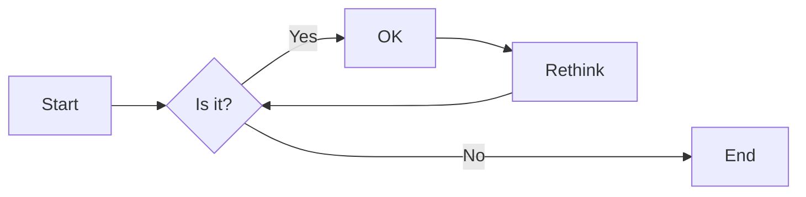
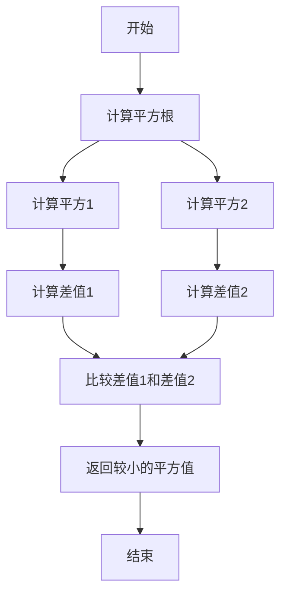

# 实验二 Python变量、简单数据类型

班级： 21计科1班

学号： 202302200000

姓名： 张三

Github地址：<https://github.com/berlincun>

CodeWars地址：<https://www.codewars.com/users/farmer3water>

---

## 实验目的

1. 使用VSCode编写和运行Python程序
2. 学习Python变量和简单数据类型

## 实验环境

1. Git
2. Python 3.10
3. VSCode
4. VSCode插件

## 实验内容和步骤

### 第一部分

实验环境的安装

1. 安装Python，从Python官网下载Python 3.10安装包，下载后直接点击可以安装：[Python官网地址](https://www.python.org/downloads/)
2. 为了在VSCode集成环境下编写和运行Python程序，安装下列VScode插件
   - Python
   - Python Environment Manager
   - Python Indent
   - Python Extended
   - Python Docstring Generator
   - Jupyter
   - indent-rainbow
   - Jinja

---

### 第二部分

Python变量、简单数据类型和列表简介

完成教材《Python编程从入门到实践》下列章节的练习：

- 第2章 变量和简单数据类型

---

### 第三部分

在[Codewars网站](https://www.codewars.com)注册账号，完成下列Kata挑战：

---

#### 第1题：求离整数n最近的平方数（Find Nearest square number）

难度：8kyu

你的任务是找到一个正整数n的最近的平方数
例如，如果n=111，那么nearest_sq(n)（nearestSq(n)）等于121，因为111比100（10的平方）更接近121（11的平方）。
如果n已经是完全平方（例如n=144，n=81，等等），你需要直接返回n。
代码提交地址
<https://www.codewars.com/kata/5a805d8cafa10f8b930005ba>

---

#### 第2题：弹跳的球（Bouncing Balls）

难度：6kyu

一个孩子在一栋高楼的第N层玩球。这层楼离地面的高度h是已知的。他把球从窗口扔出去。球弹了起来,  例如:弹到其高度的三分之二（弹力为0.66）。他的母亲从离地面w米的窗户向外看,母亲会看到球在她的窗前经过多少次（包括球下落和反弹的时候）？

一个有效的实验必须满足三个条件：

- 参数 "h"（米）必须大于0
- 参数 "bounce "必须大于0且小于1
- 参数 “window "必须小于h。

如果以上三个条件都满足，返回一个正整数，否则返回-1。
**注意:只有当反弹球的高度严格大于窗口参数时，才能看到球。**
代码提交地址
<https://www.codewars.com/kata/5544c7a5cb454edb3c000047/train/python>

---

#### 第3题： 元音统计(Vowel Count)

难度： 7kyu

返回给定字符串中元音的数量（计数）。对于这个Kata，我们将考虑a、e、i、o、u作为元音（但不包括y）。输入的字符串将只由小写字母和/或空格组成。

代码提交地址：
<https://www.codewars.com/kata/54ff3102c1bad923760001f3>

---

#### 第4题：偶数或者奇数（Even or Odd）

难度：8kyu

创建一个函数接收一个整数作为参数，当整数为偶数时返回”Even”当整数位奇数时返回”Odd”。
代码提交地址：
<https://www.codewars.com/kata/53da3dbb4a5168369a0000fe>

### 第四部分

使用Mermaid绘制程序流程图

安装Mermaid的VSCode插件：

- Markdown Preview Mermaid Support
- Mermaid Markdown Syntax Highlighting

使用Markdown语法绘制你的程序绘制程序流程图（至少一个），Markdown代码如下：


显示效果如下：



查看Mermaid流程图语法-->[点击这里](https://mermaid.js.org/syntax/flowchart.html)

使用Markdown编辑器（例如VScode）编写本次实验的实验报告，包括[实验过程与结果](#实验过程与结果)、[实验考查](#实验考查)和[实验总结](#实验总结)，并将其导出为 **PDF格式** 来提交。

## 实验过程与结果

请将实验过程与结果放在这里，包括：

- [第二部分 Python变量、简单数据类型和列表简介](#第二部分)
- [第三部分 Codewars Kata挑战](#第三部分)
```bash
1、
import math
def nearest_sq(n):
    root = math.isqrt(n)     
    square1 = root ** 2      
    square2 = (root + 1) ** 2       
    if abs(n - square1) <= abs(n - square2):
        return square1   
    else:
        return square2
```
```bash
2.
 def bouncing_ball(h, bounce, window):
    if h <= 0 or bounce <= 0 or bounce >= 1 or window >= h:
        return -1   
         not fulfilled
        
    passes = 1   
     including the first fall
    
    while h > window:
        h *= bounce   
        if h > window:
            passes += 2    
            bounce (up and down)
    
    return passes
```
```bash
3.
def get_count(sentence):
    # 初始化计数器
    vowel_count = 0
    
    # 遍历字符串中的每个字符
    for char in sentence:
        # 如果字符是元音字母之一，则增加计数器
        if char in 'aeiou':
            vowel_count += 1
    
    # 返回元音的数量
    return vowel_count
```
```bash
4.
  if number % 2 == 0:
        return "Even"
  else:
        return "Odd"
```

- [第四部分 使用Mermaid绘制程序流程图](#第四部分)

注意代码需要使用markdown的代码块格式化，例如Git命令行语句应该使用下面的格式：
显示效果如下：

```bash
git init
git add .
git status
git commit -m "first commit"
```

如果是Python代码，应该使用下面代码块格式，例如：


显示效果如下：

```python
def add_binary(a,b):
    return bin(a+b)[2:]
```

代码运行结果的文本可以直接粘贴在这里。

**注意：不要使用截图，Markdown文档转换为Pdf格式后，截图可能会无法显示。**

## 实验考查

请使用自己的语言并使用尽量简短代码示例回答下面的问题，这些问题将在实验检查时用于提问和答辩以及实际的操作。

 1、Python中的简单数据类型有那些？我们可以对这些数据类型做哪些操作？

**整数（int）**：用于表示整数值，可以执行基本的算术操作，如加法、减法、乘法和除法。

**浮点数（float）**：用于表示带有小数点的数值，支持与整数相同的算术操作，以及更复杂的数学运算，如指数、对数等。

 **字符串（str）**：用于表示文本数据，可以进行字符串连接、切片、查找、替换等操作。

 **布尔值（bool）**：用于表示真或假的布尔值，支持逻辑运算，如与（and）、或（or）、非（not）等。

*空值（NoneType）**：用于表示缺少值或空值，通常用于初始化变量或表示函数没有返回值。

这些数据类型可以执行各种操作，包括但不限于：

 **数学运算**：整数和浮点数可以执行基本的数学运算，如加法、减法、乘法、除法、取余数等。

 **比较运算**：可以比较两个值的大小，返回布尔值（True或False）。

 **逻辑运算**：可以对布尔值进行逻辑运算，如与、或、非等。

 **字符串操作**：可以对字符串进行拼接、切片、查找、替换、大小写转换等操作。

 **类型转换**：可以将一个数据类型转换为另一个数据类型，例如将整数转换为浮点数，或将字符串转换为整数。

 **变量赋值**：可以将值赋给变量，以便后续使用。

2、 为什么说Python中的变量都是标签？

在Python中，变量被称为标签是因为Python的变量实际上是对内存中某个对象的引用或标识符，而不是直接存储数据值。当你创建一个变量并将其赋值给一个对象时，实际上是在内存中创建了一个对象，然后将该对象的引用赋给了变量。

这种机制使得多个变量可以指向同一个对象，而不是复制对象的内容。当一个变量被赋予新的值时，实际上是将该变量指向一个新的对象，而不是修改原始对象的值。

3、 有哪些方法可以提高Python代码的可读性？

1. 使用有意义的变量名
2. 缩进和格式化
3. 多用注释说明
4. 使用空格和空行

## 实验总结

总结一下这次实验你学习和使用到的知识，例如：编程工具的使用、数据结构、程序语言的语法、算法、编程技巧、编程思想。

1.掌握了python的基本语法

2.学会了使用Mermaid绘制程序流程图